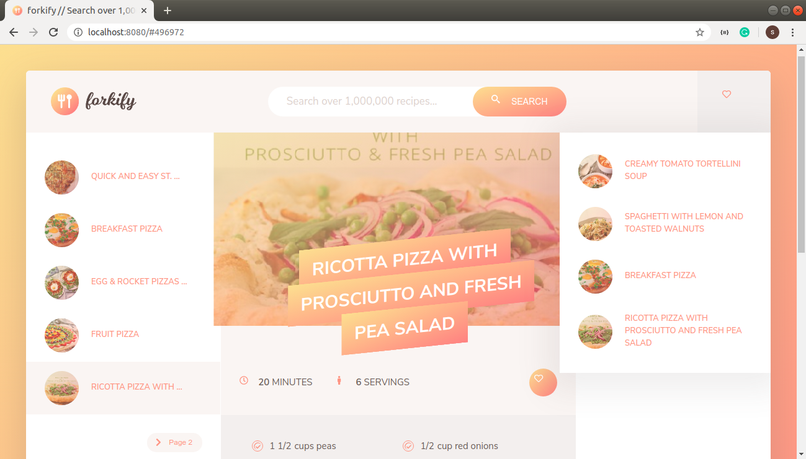
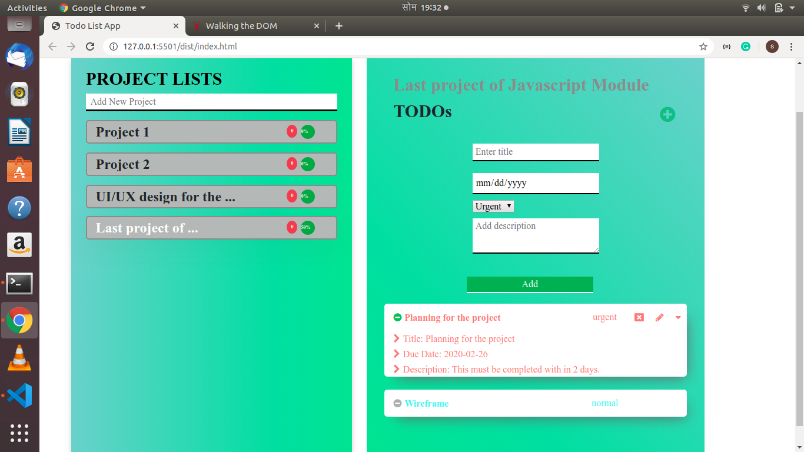
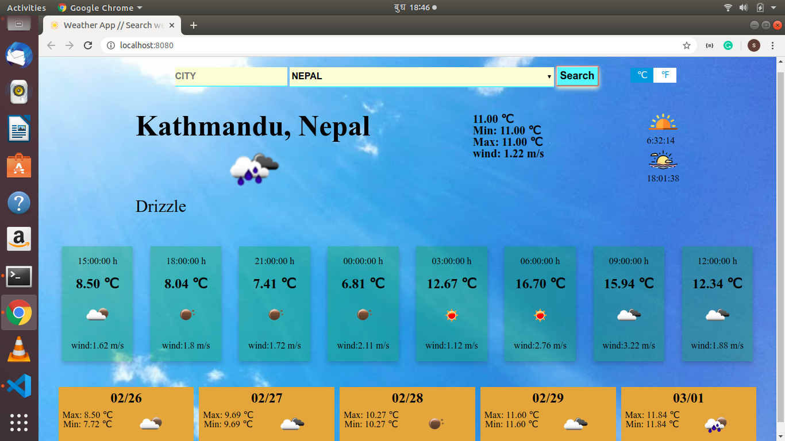

# [Forkify](https://sumancrest0001.github.io/recipe-API/)

> This is an API project where you can search thousands of recipes and get ingredients of each recipe in details. This app also changes the quantity of each ingredient based on number of servings. You can add recipes as your favorites and I used local storage for that. We can also add ingredients into shopping list and remove them if we want.

## Built With

- HTML, CSS
- Javascript
- Webpack
-[Spoonacular API](https://spoonacular.com/api)

## Live Demo

[Live Demo Link](https://sumancrest0001.github.io/recipe-API/)

# [Todo-list](https://sumancrest0001.github.io/recipe-API/)

> This project is a simple project management app. Where you can add projects and list of todos on each project. you can also edit and delete each todos. Furthermore, It will show you the project completion percentage and todos that need to be completed till current date. I implemented webpack and localStorage in this project.

## Built With

- HTML, CSS
- Javascript
- Webpack
- LocalStorage

## Live Demo

[Live Demo Link](https://sumancrest0001.github.io/todo-list/)

# [Weather-app](https://sumancrest0001.github.io/weather-app/)

> It is a simple weather APP where you can search weather condition of cities across the globe. It will display current conditions and next 4 days weather forecast. In this project, I used [openweather API](https://openweathermap.org/api) which is free.

## Built With

- HTML, CSS
- Javascript
- Webpack
- [Openweather API](https://openweathermap.org/api)

## Live Demo

[Live Demo Link](https://sumancrest0001.github.io/weather-app/)
